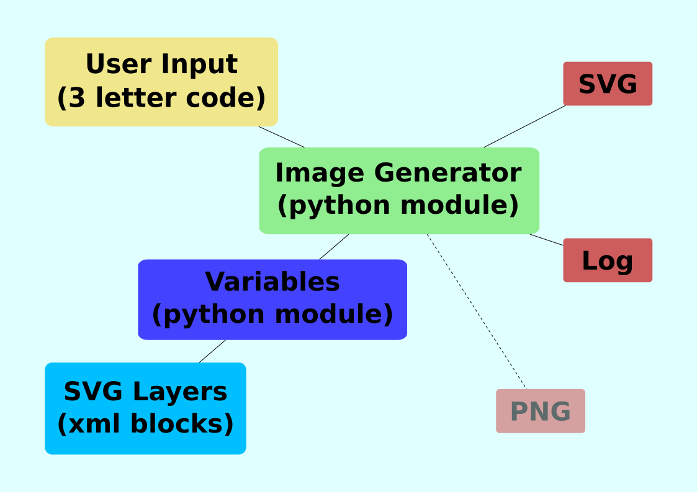
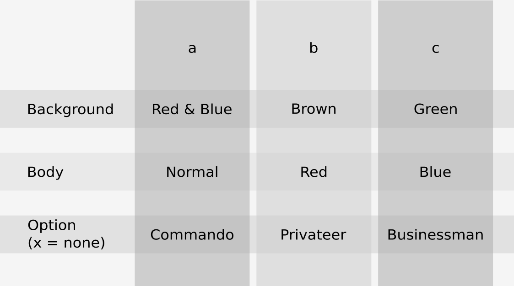

# Create and Deploy Your Own NFT - Proud Patriot


## NFT Background
Where Bitcoin was hailed as the digital answer to currency, NFTs are now being touted as the digital answer to collectables. In economics, a fungible asset is something with units that can be readily interchanged - like money.

With money, you can swap a $20 note for two $10 notes and it will have the same value. However, if something is non-fungible, this is impossible - it means it has unique properties so it can't be interchanged with something else. It could be a house, or a painting such as the Mona Lisa, which is one of a kind. You can take a photo of the painting or buy a print, but there will only ever be one original painting.

NFTs are "one-of-a-kind" assets in the digital world that can be bought and sold like any other piece of property, but which have no tangible form of their own. The digital tokens can be thought of as certificates of ownership for virtual or physical assets.

Traditional works of art such as paintings are valuable precisely because they are one of a kind. But digital files can be easily and endlessly duplicated. With NFTs, artwork can be "tokenised" to create a digital certificate of ownership that can be bought and sold.

## Getting Started (Project Overview)
1. Artwork 
    * Generate NFT (.py) and create .png 
2. Upload Artwork
    * Upload NFT metadata to IPFS via Pinata
        * Save link to NFT .json as URI will be used in .sol contract deployment
3. Create Smart Contract for NFT Deployment
    * ProudPatriotNFT.sol
    * Need wallet address and .json URI link previously saved
4. Deploy to Rinkby Testnet and OpenSea
5. Create Smart Contract to Split Sales Proceeds from NFT's
    * ProfitSplitter.sol
6. Deploy NFT to OpenSea


### 1. Artwork



The images for this collection of NFTs are generated with `python3` in the command line. First, the layers are drawn in an `SVG` editor like `Inkscape`, then the `xml` is parsed and sent to a `python module` as dictionaries that the `generator` function calls to write the final `SVG`. The `generator` is activated in the `python3` interpreter as demonstrated below.

If you want to generate PNGs, uncomment lines 40-42 in this [`python`](code/generator.py) file.

```
[📂 ~/art_reveal_project_3]
 🦅 cd code/
[📂 ~/art_reveal_project_3/code]
 🦅 python3
Python 3.9.5 (default, May 11 2021, 08:20:37) 
[GCC 10.3.0] on linux
Type "help", "copyright", "credits" or "license" for more information.
>>> from generator import writeImage, generateSet
>>> writeImage('aaa')
🦅 aaa successfully generated ✅
>>> writeImage('bbb')
🦅 bbb successfully generated ✅
>>> writeImage('aaa')
🚨 aaa already exists 🚨
>>> eagles = generateSet('abcx', 3)
>>> [writeImage(eagle) for eagle in eagles]
🚨 aaa already exists 🚨
🦅 aab successfully generated ✅
🦅 aac successfully generated ✅
🦅 aax successfully generated ✅
🦅 aba successfully generated ✅
🦅 abb successfully generated ✅
🦅 abc successfully generated ✅
🦅 abx successfully generated ✅
🦅 aca successfully generated ✅
🦅 acb successfully generated ✅
🦅 acc successfully generated ✅
🦅 acx successfully generated ✅
🦅 baa successfully generated ✅
🦅 bab successfully generated ✅
🦅 bac successfully generated ✅
🦅 bax successfully generated ✅
🦅 bba successfully generated ✅
🚨 bbb already exists 🚨
🦅 bbc successfully generated ✅
🦅 bbx successfully generated ✅
🦅 bca successfully generated ✅
🦅 bcb successfully generated ✅
                                        .....snip.....
>>> testSet = generateSet('abc', 3)
>>> len(testSet)
27
>>> testSet = generateSet('abcd', 4)
>>> len(testSet)
256
>>> testSet = generateSet('abcde', 5)
>>> len(testSet)
3125
>>> testSet = generateSet('abcdef', 6)
>>> len(testSet)
46656
>>> testSet = generateSet('abcdefg', 7)
>>> len(testSet)
823543
```

*The user input code 'aaa' would be a Normal colored eagle body with Commando gear on a Red & Blue background.*
*The user input code 'bbb' would be a Red eagle body with Privateer gear on a Brown background.*

### 2. Upload Artwork

[Pinata](https://www.pinata.cloud/) Is a free place to pin up to 1 GB of your files on IPFS, more storage can be purchased.  Once you have an account find the `Upload` button. 


Select the file you wish to upload.


The `CID` is currently in version 0 which is case-sensitive and gives some browsers issues, convert it to `CID version 1` to avoid this with the `ipfs` command line tool:

```
[📂 ~/art_reveal_project_3/code]
 🦅 ipfs cid format -v 1 -b base32 QmUTbvCRLEzrp9JXH8Uj1E2eHajckXZ2icni9au4TrmE6N
bafybeic25yd6iirhrydazth7lqz26wnbwynz4zoirnnhpjtdyvguz7z67m
```

Upload your new `CID` giving it a new name.


Create a `json` file that contains metadata complying with the `ERC-721` standard, using your new `CID` as the image address.  Upload this file to `IPFS` with `Pinata`.


Now your image and the accompanying metadata are hosted on a decentralized platform!


### 3. Create Smart Contract for NFT Deployment
* ProudPatriotNFT.sol imports ERC721 for the purposes of demonstrating integration with the OpenSea marketplace. We also include a script for minting the NFT items
* Change environment to Injected Web3 and make sure you are connected to MetaMask Rinkeby Test Network
* Make sure Proud_Patriot contract is selected and click deploy
* Confirm contract deployment on MetaMask

### 4. Deploy to Rinkby Testnet and OpenSea
* After deploying ProudPatriotNFT.sol to Rinkeby network, there will be a contract on Rinkeby that will be viewable on Rinkeby Etherscan. You will aslo be able to see your NFT on your OpenSea profile.
* Click on registerArt tab in the deployed Contract
* Copy your MetaMask account address into the "owner" input box
* Name your NFT in the "description" input box
* Past URI link into the "token_uri" input box (this linke was generated while uploading Artwork - see section above)
* Click the transact button
* Go https://testnets.opensea.io/ and check under your profile to confirm NFT was sucessfully deployed!

### 5. Create Smart Contract to Split Sales Proceeds from NFT's
Once a sale is completed and the money is deposited into the OpenSea account it is then sent to our smart contract address. Here it will be equaly divided and sent to each of the group memeber wallets. 

### 6. Deploy to NFT to Mainnet
After running your project on a testnet for some time without issues, you will want to deploy it to the main Ethereum network (aka mainnet). Make sure your wallet has at least a few dollars worth of ETH in it.

Please visit the following link for a full guide for preparing to deploy to the mainnet: https://docs.openzeppelin.com/learn/preparing-for-mainnet

Tip 1: OpenSea will automatically pick up transfers on your contract. You can visit an asset by going to https://opensea.io/assets/CONTRACT_ADDRESS/TOKEN_ID.

Tip 2: To load all your metadata on your items at once, visit https://opensea.io/get-listed and enter your address to load the metadata into OpenSea!
